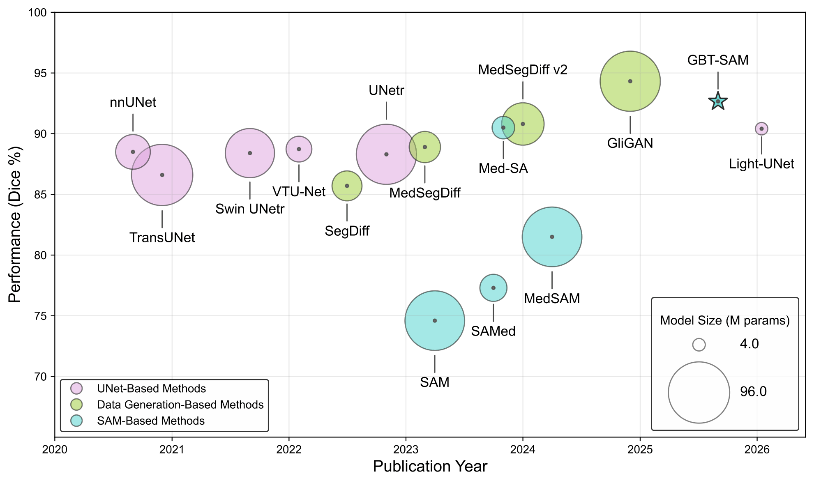
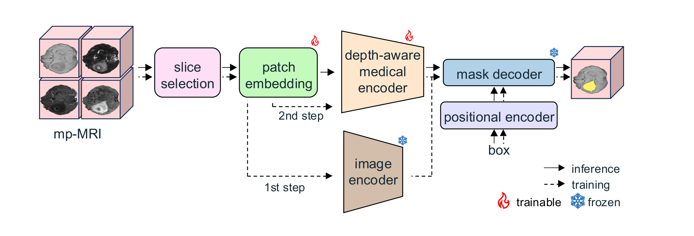

# GBT-SAM: A Parameter-Efficient Depth-Aware Model for Generalizable Brain Tumor Segmentation on mp-MRI

[cite_start]Official repository for the paper: **"GBT-SAM: A Parameter-Efficient Depth-Aware Model for Generalizable Brain Tumor Segmentation on mp-MRI"**[cite: 3].

[](https://arxiv.org/abs/2503.04325)

---

## Overview

[cite_start]GBT-SAM adapts the Segment Anything Model (SAM) to volumetric multi-parametric MRI (mp-MRI) data for brain tumor segmentation[cite: 17]. [cite_start]Standard foundational vision models are typically constrained by 3-channel inputs and process 3D slices in isolation, ignoring critical inter-slice spatial continuity[cite: 38, 61, 62]. [cite_start]GBT-SAM resolves these limitations via a true 4-channel multi-modal patch embedding layer and a lightweight Depth-Condition module to extract inter-slice dependencies efficiently[cite: 72, 73, 74].


[cite_start]*Figure 1: Comparison of state-of-the-art brain tumor segmentation frameworks based on accuracy (Dice Score) and number of trainable parameters[cite: 112, 113]. [cite_start]GBT-SAM delivers top-tier performance with the lowest parameter footprint among SAM-based alternatives[cite: 19, 115].*

---

## Key Features

* [cite_start]**High-Performance Efficiency:** The framework operates with only **9.97M trainable parameters** while achieving competitive segmentation performance[cite: 19, 446, 478].
* [cite_start]**True Multi-modal Processing:** Modifies SAM's foundational patch embedding layer to natively accept 4-channel mp-MRI sequences (T1, T2, T1c, and T2-FLAIR) simultaneously, preserving comprehensive multi-modal features[cite: 72, 250, 255].
* [cite_start]**Depth-Conditioned Context:** Incorporates a parallel linear mixing and Multi-Layer Perceptron (MLP) module across the depth dimension to efficiently capture inter-slice volumetric dependencies without heavy 3D operations[cite: 73, 333, 336].
* [cite_start]**Robust Domain Generalization:** Validated across four distinct clinical domains, demonstrating superior zero-shot transfer capabilities and domain robustness[cite: 77, 365].

---

## Architecture Overview


[cite_start]*Figure 2: Overview of the GBT-SAM architecture and two-step training pipeline[cite: 204].*

[cite_start]The network utilizes a **two-step fine-tuning protocol**[cite: 19, 260]:
1. [cite_start]**Stage 1 (Patch Embedding Optimization):** Freezes the entire architecture except for the modified 4-channel patch embedding layer to ensure optimal multi-modal alignment[cite: 206, 262, 263].
2. [cite_start]**Stage 2 (Joint Fine-Tuning):** Introduces Low-Rank Adaptation (LoRA) modules alongside the Depth-Condition (D.C.) blocks within the Vision Transformer (ViT) layers for specialized domain transfer[cite: 207, 264, 270].

[cite_start]During training, computational overhead is mitigated by sampling small subsets of consecutive slices per volume[cite: 274, 275]. [cite_start]At inference time, full-volume dense 3D predictions are systematically executed via a sliding window approach[cite: 277, 278].

---

## Experimental Results

[cite_start]The model is trained exclusively on the BraTS Adult Glioma dataset and evaluated zero-shot across multiple unseen modalities and tumor topologies to assess generalizability[cite: 21, 362, 365].

| Domain / Evaluation Dataset | Evaluation Type | Dice Score (DS) |
| :--- | :--- | :--- |
| **Adult Glioma ($DS_1$)** | In-Domain (Test Split) | [cite_start]**92.66** [cite: 20, 446] |
| **Meningioma ($DS_2$)** | Zero-Shot Cross-Domain | [cite_start]**91.90** [cite: 365, 446] |
| **Pediatric Glioma ($DS_3$)** | Zero-Shot Cross-Domain | [cite_start]**91.40** [cite: 365, 446] |
| **Sub-Saharan Glioma ($DS_4$)** | Zero-Shot Cross-Domain | [cite_start]**91.19** [cite: 365, 446] |
| **Cross-Domain Mean ($DS_{234}$)** | Combined Unseen Average | [cite_start]**91.50** [cite: 376, 446] |

---

## Setup and Usage

All requirements, environment configurations, dataset preparation guidelines, and execution commands for training, validation, and inference are detailed in:
👉 **[INSTRUCTIONS.md](INSTRUCTIONS.md)**

---

## Citation

If you find this repository or our architectural approach useful for your research, please cite our work:

```bibtex
@article{diana2025gbtsam,
  title={GBT-SAM: A Parameter-Efficient Depth-Aware Model for Generalizable Brain Tumor Segmentation on mp-MRI},
  author={Diana-Albelda, Cecilia and Alcover-Couso, Roberto and Garc{\'\i}a-Mart{\'\i}n, {\'A}lvaro and Bescos, Jesus and Escudero-Vi{\~n}olo, Marcos},
  journal={arXiv preprint arXiv:2503.04325}, 
  year={2025}
}
